# NeoLeadge Database Schema

**Engine:** PostgreSQL 16 · **ORM:** Prisma 7 · **Models:** 46

This document describes every table in the NeoLeadge database, grouped by domain, with column types, foreign keys, indexes, and an explanation of how each table fits the overall workflow.

---

## Table of contents

- [Overview](#overview)
- [Relational diagram](#relational-diagram)
- [1. Identity and access (RBAC)](#1-identity-and-access-rbac)
- [2. Project core](#2-project-core)
- [3. Cahier des charges (specification)](#3-cahier-des-charges-specification)
- [4. Meetings](#4-meetings)
- [5. Work packages (tasks)](#5-work-packages-tasks)
- [6. Agile (boards / sprints / versions)](#6-agile-boards--sprints--versions)
- [7. Gantt (milestones / baselines)](#7-gantt-milestones--baselines)
- [8. Time tracking](#8-time-tracking)
- [9. Wiki](#9-wiki)
- [10. Notifications and automation](#10-notifications-and-automation)
- [11. Cross-cutting (audit, cache, checklists)](#11-cross-cutting-audit-cache-checklists)
- [Soft-delete and cascade rules](#soft-delete-and-cascade-rules)
- [Migration history](#migration-history)

---

## Overview

NeoLeadge is a project-management platform for IT deployment projects. Its primary workflow is:

```
PM creates project
  → adds team members (with custom labels)
  → fills questionnaire
  → uploads meeting recordings (auto-transcribed + AI-analysed)
  → generates a Cahier des Charges (AI from questionnaire + cahier + meetings)
  → SpecificationTeam reviews + approves/rejects
  → PM generates a backlog from the cahier (AI-proposed Epics + Tasks)
  → PM drags tasks onto team members in the assignment board
  → team executes via Work Packages, Kanban, Gantt, Sprints
```

Most of the schema's complexity lives outside that primary chain — it's the surrounding infrastructure for time tracking, attachments, automation rules, audit, RBAC, and cross-team handoffs.

---

## Relational diagram

```mermaid
erDiagram
  AppUser ||--o{ Project : "owns (PM)"
  AppUser ||--o{ ProjectMember : "is on team"
  AppUser ||--o{ UserRoleAssignment : "has role"
  Project ||--o{ ProjectMember : "has team"
  Project ||--o{ ProjectField : "has questions"
  ProjectField ||--o{ ProjectFieldValue : "answers"
  Project ||--o{ ProjectValidation : "phase approvals"
  Project ||--o{ MeetingTranscript : "has meetings"
  MeetingTranscript ||--o{ TranscriptSegment : "speaker-diarized"
  MeetingTranscript ||--o{ MeetingActionItem : "AI extracts"
  MeetingTranscript ||--o{ MeetingDecision : "AI extracts"
  Project ||--o{ CahierFeedback : "review history"
  Project ||--o{ WorkPackage : "tasks"
  WorkPackage ||--o{ WorkPackage : "parent / children"
  WorkPackage ||--o{ WorkPackageDependency : "blocks/follows"
  WorkPackage ||--o{ WorkPackageWatcher : "subscribers"
  WorkPackage ||--o{ WorkPackageComment : "discussion"
  Project ||--o{ Board : "kanban"
  Board ||--o{ BoardColumn : "columns"
  Board ||--o{ Sprint : "iterations"
  Project ||--o{ Version : "releases"
  Project ||--o{ Milestone : "key dates"
  Project ||--o{ TimeEntry : "logged hours"
  Project ||--o{ WikiPage : "knowledge base"
  WikiPage ||--o{ WikiRevision : "history"
  Project ||--o{ AutomationRule : "workflow rules"
  AutomationRule ||--o{ AutomationLog : "execution log"
  AppUser ||--o{ Notification : "inbox"
  Permission }o--o{ Role : "RolePermission"
  Role ||--o{ UserRoleAssignment : "assigned to users"
  Project ||--o{ UserRoleAssignment : "scoped to project"
```



---

## 1. Identity and access (RBAC)

### `Teams`

Functional grouping of users. Each user can belong to one team; each team has a manager.

| Column | Type | Notes |
|---|---|---|
| `id` | TEXT (uuid) | PK |
| `code` | VARCHAR(50) | UNIQUE — short code (e.g. CLOUD, PS, INTEG) |
| `name` | VARCHAR(200) | Human-readable name |
| `managerUserId` | VARCHAR(36) | nullable — points to AppUser |
| `createdAt` | TIMESTAMPTZ | default now() |

### `AppUsers`

The identity table. Authentication, role, profile, and all user-level state.

| Column | Type | Notes |
|---|---|---|
| `id` | TEXT (uuid) | PK |
| `firstName`, `lastName` | VARCHAR(100) | |
| `email` | VARCHAR(256) | UNIQUE |
| `passwordHash` | TEXT | bcrypt rounds=12 |
| `role` | VARCHAR(50) | `Admin` / `ProjectManager` / `SpecificationTeam` / `Member` |
| `isActive` | BOOLEAN | soft-disable |
| `lastLoginAt` | TIMESTAMPTZ | nullable |
| `mustChangePassword` | BOOLEAN | first login or admin-forced |
| `failedLoginAttempts` | INT | lockout counter |
| `lockedUntil` | TIMESTAMPTZ | nullable |
| `avatarPath` | VARCHAR(500) | path to uploaded avatar |
| `jobTitle`, `phoneNumber`, `department` | VARCHAR(100/50/100) | profile fields |
| `preferences` | TEXT | JSON blob — emailNotifications, dark mode, etc. |
| `totpSecret`, `totpEnabled`, `totpVerifiedAt` | — | 2FA state |
| `tokenVersion` | INT | bump invalidates all JWTs (e.g. on role change) |
| `teamId` | VARCHAR(36) | FK → Teams |
| `passwordResetToken`, `passwordResetTokenExpiry` | — | one-time reset link |

**Indexes:** none beyond PK and UNIQUE(email). The table is small enough to scan.

### `Permissions`

Catalogue of every fine-grained action key (e.g. `wp.create`, `gantt.manage_baselines`, `members.add`).

| Column | Type | Notes |
|---|---|---|
| `id` | TEXT (uuid) | PK |
| `key` | VARCHAR(100) | UNIQUE — referenced by `@RequirePermission()` |
| `resource` | VARCHAR(50) | grouping (e.g. `wp`, `gantt`, `members`) |
| `description` | VARCHAR(255) | shown in admin UI |

### `Roles`

Named bundles of permissions. Built-in roles are seeded from `permission-keys.ts`.

| Column | Notes |
|---|---|
| `id`, `name` (UNIQUE), `isPreset`, `description` | |

### `RolePermissions`

Many-to-many between `Roles` and `Permissions`. Composite PK `(roleId, permissionId)`.

### `UserRoleAssignments`

Who has which role, optionally scoped to a project.

| Column | Notes |
|---|---|
| `userId`, `roleId`, `projectId?` | FK to each |
| `@@unique(userId, roleId, projectId)` | a user/role pair can be assigned globally and per-project |

A `NULL` `projectId` is a global assignment. **Important**: the `ProjectAccessGuard` ignores global assignments for non-Admin users — non-Admin users must have either a project-scoped assignment, be the project's PM, or be in `ProjectMembers`. This prevents IDOR via leaked global assignments.

---

## 2. Project core

### `Projects`

The root entity for everything else.

| Column | Type | Notes |
|---|---|---|
| `id` | TEXT (uuid) | PK |
| `name`, `clientName` | VARCHAR(200) | |
| `startDate`, `endDate` | TIMESTAMPTZ | |
| `projectManagerId` | TEXT | FK → AppUser, **NoAction** on delete |
| `status` | VARCHAR(50) | The 9-phase status: `Draft` → `Launch` → `Framing` → `Environment` → `Configuration` → `Integration` → `Acceptance` → `GoLive` → `Closure` |
| `priority` | VARCHAR(50) | `Low` / `Medium` / `High` / `Critical` |
| `allowManagerCustomFields` | BOOLEAN | gate for the PM adding their own fields |
| `createdByAdminId` | TEXT | FK → AppUser, NoAction |
| `aiOutput` | TEXT | **Stores the saved cahier as JSON** — see [Cahier](#3-cahier-des-charges-specification) |
| `isDeleted`, `deletedAt`, `deletedByUserId` | — | soft-delete |
| `tags`, `budget` | VARCHAR(500), DECIMAL | metadata |
| `currentPhaseEnteredAt` | TIMESTAMPTZ | when the project entered its current `status` (drives "stuck in phase" alerts) |

**Indexes:** `(status)`, `(projectManagerId)`, `(isDeleted)`, `(priority)`, `(createdAt)`, `(isDeleted, status)`.

### `ProjectMembers`

The per-project team. Each row is one user added to one project, with a free-form label that describes their role on this specific project.

| Column | Type | Notes |
|---|---|---|
| `id` | TEXT (uuid) | PK |
| `projectId` | VARCHAR(36) | FK → Projects, CASCADE |
| `userId` | VARCHAR(36) | FK → AppUsers, CASCADE |
| `label` | VARCHAR(150) | e.g. "Lead Frontend", "QA", "Spécialiste GED" — free text, validated to 60 chars max + regex |
| `createdAt` | TIMESTAMPTZ | |
| `@@unique(projectId, userId)` | one row per (project, user) | |
| `@@index(projectId)`, `@@index(userId)` | | |

This is the **per-project access primitive**. Notifications, the cahier review banner, and the assignment board all check membership here.

### `ProjectFields`

Definition of a question on the project's questionnaire. Some are static (admin-defined per template), some are dynamic (added per project).

| Column | Type | Notes |
|---|---|---|
| `id`, `projectId` | uuid | |
| `label` | VARCHAR(200) | the question text |
| `fieldType` | VARCHAR(50) | `Text`, `LongText`, `Number`, `Date`, `Select`, `MultiSelect` |
| `fieldCategory` | VARCHAR(50) | `Static` (from template), `Dynamic` (PM-added), `Custom` |
| `orderIndex` | INT | display order |
| `isBacklogDriver` | BOOLEAN | if true, the AI uses this answer to generate the backlog |
| `backlogHint` | TEXT? | hint passed to the LLM when generating the backlog |

### `ProjectFieldValues`

The PM's answers.

| Column | Notes |
|---|---|
| `projectId`, `projectFieldId` (UNIQUE pair), `value` (TEXT), `updatedAt`, `updatedByUserId` | |

### `ProjectValidations`

Phase-level approvals. When the project advances from one phase to the next, designated users record an approval here.

| Column | Notes |
|---|---|
| `id`, `projectId`, `validatedByUserId`, `phase` (project status), `isApproved`, `comment`, `validatedAt` | |
| `@@unique(projectId, validatedByUserId, phase)` | one approval per user per phase |
| `@@index(projectId, phase)` | for the queue queries |

**Note:** This is *not* the cahier validation. The cahier has its own table — see `CahierFeedback`.

### `ProjectActivities`

Generic activity feed. Every state-change action creates a row here so the activity tab and the history view can render a timeline.

### `ProjectComments`

Generic discussion thread per project (separate from work-package comments).

### `ProjectAttachments`

File uploads scoped to a project. Categorised: `Document`, `Specification`, `Contract`, `Screenshot`, `Image`, `Report`, `Other`.

### `ProjectTemplates` + `ProjectTemplateFields`

Pre-defined sets of fields that can be applied when creating a new project. The "Modèles" / form-model feature in the PM nav.

---

## 3. Cahier des charges (specification)

The cahier itself is **not a separate table** — it's stored as a JSON string in `Project.aiOutput`. The structure is:

```json
{
  "aiContent": {
    "objectifDocument": "...",
    "contexte": "...",
    "objectifProjet": "...",
    "perimetreInclus": "...",
    "perimetreExclus": "...",
    "exigencesFonctionnelles": [{ "title": "...", "content": "..." }],
    "architectureTechnique":   [{ "title": "...", "content": "..." }],
    "livrables": "...",
    "conclusion": "..."
  },
  "savedAt": "2026-05-04T11:23:18.420Z"
}
```

### `CahierFeedback`

Each approve/reject action by a SpecificationTeam reviewer creates a row. The next time the AI regenerates the cahier, all rejection comments are injected into the prompt so the model corrects itself.

| Column | Type | Notes |
|---|---|---|
| `id` | uuid | |
| `projectId` | uuid | FK → Projects, CASCADE |
| `userId` | uuid? | FK → AppUsers, **SetNull** — feedback survives user deletion |
| `status` | VARCHAR(20) | `approved` / `rejected` |
| `comment` | TEXT | required on rejection (≥10 chars) |
| `section` | VARCHAR(100)? | which section of the cahier was problematic |
| `aiModel` | VARCHAR(50)? | which model produced the rejected version |
| `createdAt` | TIMESTAMPTZ | |
| `@@index(projectId, createdAt)` | composite — drives the status-aggregation query |

**Status derivation:** the cahier's effective status is computed by joining `CahierFeedback` filtered by `createdAt >= savedAt` (the timestamp embedded in `aiOutput`). Any feedback older than the latest save is ignored — regenerating resets the review.

---

## 4. Meetings

### `MeetingTranscripts`

One row per uploaded meeting recording.

| Column | Type | Notes |
|---|---|---|
| `id`, `projectId` | uuid | |
| `title` | VARCHAR(255) | |
| `recordedAt` | TIMESTAMPTZ | |
| `durationSeconds` | INT | |
| `audioPath` | VARCHAR(500)? | path on disk |
| `aiStatus` | VARCHAR(20) | `pending` / `processing` / `completed` / `failed` |
| `aiSummary` | TEXT? | AI-generated markdown summary |
| `aiModel` | VARCHAR(50)? | model that produced the summary |
| `aiStartedAt`, `aiProcessedAt`, `aiError` | — | observability |

### `TranscriptSegments`

Speaker-diarized chunks. Each segment is one speaker's contiguous utterance.

| Column | Notes |
|---|---|
| `transcriptId` | FK → MeetingTranscripts, CASCADE |
| `speaker` | VARCHAR(100) — "Speaker 1" by default, can be renamed |
| `text` | TEXT |
| `startTime`, `endTime` | seconds |
| `language` | VARCHAR(10) — auto-detected per segment, supports FR/EN/AR |
| `confidence` | FLOAT |

### `MeetingActionItems` and `MeetingDecisions`

AI extracts. After transcription completes, the AI parses the transcript and writes one row per action item or decision found.

### `MeetingAgendaItems`, `MeetingAttendees`, `MeetingOutcomes`

Pre/post-meeting structure. Agenda items, attendance tracking (present/absent), and recorded outcomes that can be converted directly into work packages.

---

## 5. Work packages (tasks)

### `WorkPackages`

The unit of work. Each task / feature / bug / epic is one row.

| Column | Type | Notes |
|---|---|---|
| `id`, `projectId` | uuid | |
| `authorId` | uuid | FK → AppUsers |
| `assigneeId` | uuid? | FK → AppUsers |
| `parentId` | uuid? | self-FK — Epic → Task hierarchy |
| `title` | VARCHAR(500) | |
| `description` | TEXT | |
| `type` | VARCHAR(50) | `Task` / `Feature` / `Bug` / `Epic` / `Incident` |
| `status` | VARCHAR(50) | `New` / `InProgress` / `AwaitingReview` / `OnHold` / `Resolved` / `Closed` |
| `priority` | VARCHAR(50) | `Low` / `Normal` / `High` / `Critical` |
| `estimatedHours` | DECIMAL? | |
| `actualHours` | DECIMAL? | derived from time entries |
| `startDate`, `dueDate` | DATE | for Gantt rendering |
| `sprintId`, `versionId`, `boardColumnId` | uuid? | which sprint / release / column |
| `slaDeadline`, `slaBreached` | — | SLA tracking |
| `aiGeneratedFrom` | VARCHAR(100)? | tag like `questionnaire+cahier+meeting` |
| `isDeleted` | BOOLEAN | soft-delete |
| `createdAt`, `updatedAt` | — | |

**Indexes:** `(projectId, isDeleted, status)`, `(projectId, status)`, `(assigneeId, isDeleted)`, `(assigneeId)`, `(parentId)`, `(sprintId)`, `(versionId)`, `(boardColumnId)`, `(slaDeadline, slaBreached)`.

### `WorkPackageDependencies`

Directed graph. `fromWpId` blocks / follows / relates to `toWpId`. UNIQUE on `(fromWpId, toWpId, type)`.

### `WorkPackageWatchers`

User subscriptions to WP changes. UNIQUE on `(workPackageId, userId)`.

### `WorkPackageCustomFields` + `WorkPackageCustomValues`

Per-project user-defined attributes on tasks. UNIQUE `(workPackageId, customFieldId)` — one value per WP per field.

### `WorkPackageComments`

Threaded discussion on a WP.

### `WorkPackageAttachments`

Files uploaded to a specific WP.

---

## 6. Agile (boards / sprints / versions)

### `Boards`

Kanban container. UNIQUE `(projectId, name)`. The system auto-creates a "Default Kanban" with 4 columns on first GET.

### `BoardColumns`

Columns within a board. Has `position` and optional `wipLimit`.

### `Sprints`

Time-boxed iterations. Status: `Planning` / `Active` / `Closed`. Linked to a board.

### `Versions`

Release versions per project. Status: `Open` / `Locked` / `Closed`. WPs reference a version via `WorkPackage.versionId`.

---

## 7. Gantt (milestones / baselines)

### `Milestones`

Diamond-marker dates on the Gantt timeline. Optionally linked to a specific WP.

| Column | Notes |
|---|---|
| `projectId`, `workPackageId?`, `title`, `date`, `isReached`, `color` | |

### `GanttBaselines`

Dated snapshots of WP start/end dates so drift can be visualised. UNIQUE `(projectId, snapshotName, workPackageId)`.

---

## 8. Time tracking

### `TimeEntries`

One row per logged hour-block.

| Column | Notes |
|---|---|
| `userId`, `projectId`, `workPackageId?`, `hours` (DECIMAL), `spentOn` (DATE), `comment`, `isBillable`, `lockedAt` | |
| `@@index(userId, spentOn)`, `@@index(projectId, spentOn)`, `@@index(workPackageId)` | |

**Locking:** an admin can lock a period (`lockedAt`) to prevent retroactive edits.

> **Note:** `HourlyRates` was removed in May 2026 along with the budgeting module. Effective rate calculation is no longer part of the platform.

---

## 9. Wiki

### `WikiPages`

Markdown knowledge-base pages, optionally hierarchical. UNIQUE `(projectId, slug)`.

| Column | Notes |
|---|---|
| `projectId`, `title`, `slug`, `content` (TEXT), `authorId`, `parentId?`, `version`, `isDeleted` | |

### `WikiRevisions`

Full revision history. Every save creates a new version. UNIQUE `(wikiPageId, version)`.

> **Note:** As of May 2026 the wiki is no longer surfaced in the project sidebar (the route was removed). The data is preserved.

---

## 10. Notifications and automation

### `Notifications`

Per-user inbox. Real-time push via Socket.IO + optional email.

| Column | Type | Notes |
|---|---|---|
| `userId` | FK → AppUsers, **CASCADE** — notifications are deleted with the user |
| `type` | VARCHAR(50) | `wp_assigned`, `cahier_ready`, `cahier_approved`, `cahier_rejected`, etc. |
| `title`, `message` | VARCHAR(200/500) | |
| `projectId?` | FK → Projects, **SetNull** | survives project deletion |
| `reason` | VARCHAR(40) | `Mention`, `Assignee`, `Watcher`, `Deadline`, `StatusChange`, `Comment`, `System` |
| `entityType`, `entityId` | — | what entity the notification is about |
| `actorId?` | FK → AppUsers ("NotificationActor"), **SetNull** | who triggered it (so we can avoid self-notifying) |
| `link` | VARCHAR(500)? | front-end URL to navigate to |
| `isRead`, `createdAt` | — | |

**Indexes:** `(userId, isRead, createdAt DESC)` (unread-bell query), `(userId, isRead)`, `(userId, createdAt)`, `(entityType, entityId)`, `(userId, reason)`.

### `AutomationRules`

PM-defined "when X happens, do Y" rules per project.

| Column | Notes |
|---|---|
| `projectId`, `name`, `triggerEvent` (e.g. `cahier_generated`, `status_changed`, `validation_submitted`), `conditions` (JSON), `actionType` (`send_notification` / `update_field`), `actionConfig` (JSON), `isActive`, `createdAt` | |

### `AutomationLog`

Execution history of every rule fire — input event, action taken, success/failure.

---

## 11. Cross-cutting (audit, cache, checklists)

### `PhaseChecklists`

Per-phase tick-list items. Currently has no authoring UI in the frontend but the backend service is wired.

### `AuditLogs`

Sensitive-action audit trail (user delete, role change, project hard-delete, etc.).

### `AnalyticsCache`

Generic 15-minute TTL cache for the analytics dashboard's expensive aggregations.

---

## Soft-delete and cascade rules

The platform follows three different deletion strategies depending on the table:

| Strategy | When | Examples |
|---|---|---|
| **Soft-delete** (`isDeleted = true`) | Projects, work packages, wiki pages | Allows un-delete via the Trash UI; preserves audit trail |
| **CASCADE** | Children that don't make sense without the parent | `ProjectMember` (cascades on Project or User delete), `TranscriptSegment`, `WorkPackageDependency`, `WorkPackageCustomValue`, `Notification.user` |
| **SetNull** | History rows that should survive | `CahierFeedback.user` (we keep the rejection comment even if the user is deleted), `Notification.actor`, `Notification.project` |
| **NoAction** | Strict integrity (the parent must not be deletable) | `Project.projectManager`, `Project.createdByAdmin`, `WikiPage.author`, `TimeEntry.user`, `WorkPackage.author` |

`CASCADE` on `Notification.user` is intentional: notifications are personal — when a user is removed from the system their inbox goes with them. Audit logs use `NoAction` for traceability; notifications do not.

---

## Migration history

| # | Migration | Applied | Purpose |
|---|---|---|---|
| 1 | `20260427212925_init_postgres` | 2026-04-27 | Bootstrap from MySQL → PostgreSQL |
| 2 | `20260502120000_add_project_members` | 2026-05-02 | Per-project team table |
| 3 | `20260503010000_cahier_feedback_index` | 2026-05-03 | Composite `(projectId, createdAt)` for status query |
| 4 | `20260503020000_wp_custom_value_index` | 2026-05-04 | Index `customFieldId` to speed cascading deletes |
| 5 | `20260504020000_drop_orphan_tables` | 2026-05-04 | Drop `ProjectBudgets`, `BudgetLineItems`, `Handovers`, `HandoverCriteria`, `ActivityRacis`, `HourlyRates` |

All migrations are tracked in `web/back-nest/prisma/migrations/`. Apply with `npx prisma migrate deploy`.

---

## Conventions

- **All UUIDs** are stored as `TEXT` (the Prisma default). Some legacy FK columns are typed as `VARCHAR(36)` to match earlier MySQL-side conventions; the type difference does not affect joins.
- **All timestamps** are `TIMESTAMP(3)` UTC.
- **Soft-delete** is opt-in per table — most have `isDeleted` only where genuinely needed (Projects, WorkPackages, WikiPages).
- **Map names** — every Prisma model has `@@map("PluralPascalCase")` to give predictable database table names regardless of model casing.
- **Indexes** are added explicitly via `@@index([...])` based on real query shapes; we don't index speculatively.
