# NeoLeadge — Database Schema Reference

**Engine:** PostgreSQL 16 · **ORM:** Prisma 7 · **Models:** 44 · **Last update:** 2026-05-04

---

## Table of contents

1. [Architecture context](#1-architecture-context)
2. [Primary workflow](#2-primary-workflow)
3. [System-wide ER diagram](#3-system-wide-er-diagram)
4. [Schema-wide conventions](#4-schema-wide-conventions)
5. [Domain 1 — Identity & RBAC](#domain-1--identity--rbac)
6. [Domain 2 — Project core](#domain-2--project-core)
7. [Domain 3 — Cahier des charges](#domain-3--cahier-des-charges-specification-document)
8. [Domain 4 — Meetings](#domain-4--meetings)
9. [Domain 5 — Work packages (tasks)](#domain-5--work-packages-tasks)
10. [Domain 6 — Agile (boards / sprints / versions)](#domain-6--agile-boards--sprints--versions)
11. [Domain 7 — Gantt](#domain-7--gantt-milestones--baselines)
12. [Domain 8 — Time tracking](#domain-8--time-tracking)
13. [Domain 9 — Notifications & automation](#domain-9--notifications--automation)
14. [Domain 10 — Cross-cutting (audit, cache, checklists)](#domain-10--cross-cutting-audit-cache-checklists)
16. [Soft-delete and cascade strategy](#16-soft-delete-and-cascade-strategy)
17. [JSON columns](#17-json-columns)
18. [Indexing philosophy](#18-indexing-philosophy)
19. [Migration history](#19-migration-history)
20. [Glossary](#20-glossary)

---

## 1. Architecture context

NeoLeadge is a project-management platform built for IT-deployment projects (specifically the Elise/Archimed product line at NeoLedge). It centralises everything from initial scoping to delivery handover.

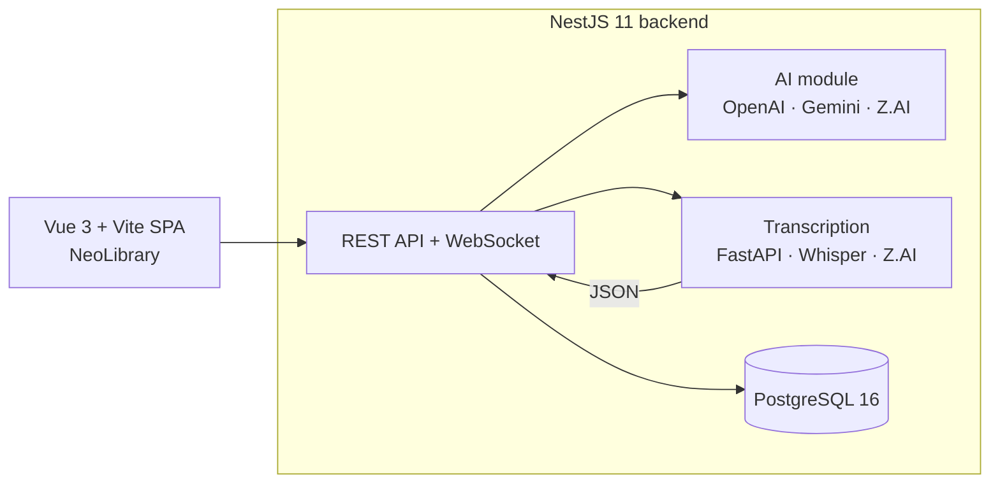

The database is the single source of truth. All AI outputs (cahier, backlog, meeting summaries) are persisted; the AI providers are strictly stateless.

---

## 2. Primary workflow

The schema is organised around one main flow:

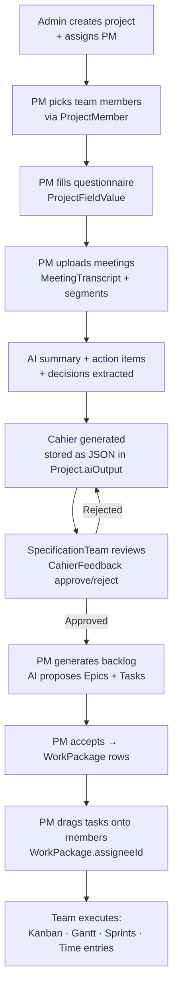

Most tables in the schema are either part of this chain or are surrounding infrastructure (RBAC, notifications, audit, attachments, automation rules).

---

## 3. System-wide ER diagram

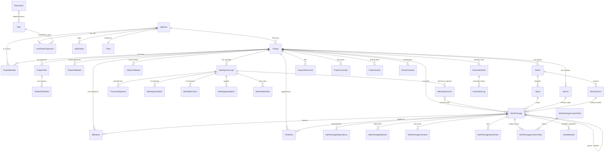

---

## 4. Schema-wide conventions

| Convention | Detail |
|---|---|
| **IDs** | `String @id @default(uuid())` — all PKs are version-4 UUIDs stored as TEXT. Some legacy FKs are `VARCHAR(36)` to match earlier MySQL compat columns; the type difference does not affect joins. |
| **Timestamps** | All `DateTime` columns map to `TIMESTAMP(3)` UTC. |
| **Enums** | Stored as `String @db.VarChar(N)`. Application code validates values at the DTO layer. This avoids `ALTER TABLE` rewrites every time a value is added. |
| **Soft-delete** | Opt-in per table: `Project`, `WorkPackage`, `ProjectComment`, `WorkPackageComment`, `ProjectAttachment`, `WorkPackageAttachment` have `isDeleted Boolean`. |
| **Map names** | Every model has `@@map("PluralPascalCase")` — table names match what you'd type in `psql`. |
| **Cascade policy** | See [§16](#16-soft-delete-and-cascade-strategy). Children of a deleted parent CASCADE; history rows SetNull; integrity-critical FKs use NoAction. |
| **JSON storage** | Three columns hold JSON: `Project.aiOutput`, `AppUser.preferences`, `AutomationRule.actionConfig`. See [§17](#17-json-columns). |
| **Indexes** | Added explicitly on real query shapes only. No speculative indexing. See [§18](#18-indexing-philosophy). |

---

# Domain 1 — Identity & RBAC

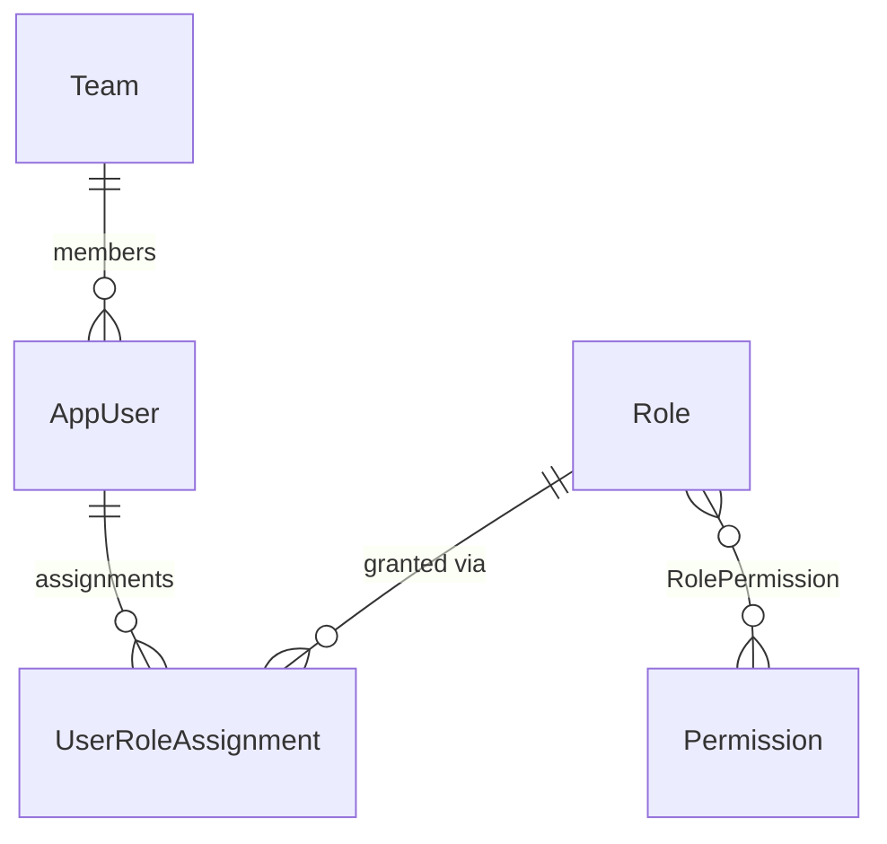

The platform uses an OpenProject-style data-driven RBAC: Permissions are catalogued, Roles bundle them, and Roles are assigned to users either globally or per-project.

### Table: `Teams`

Functional grouping of users (Cloud team, Professional Services, Integration, Delivery). Each team has at most one manager.

| Column | Type | Null | Default | Notes |
|---|---|---|---|---|
| `id` | TEXT | no | uuid() | PK |
| `code` | VARCHAR(50) | no | — | **UNIQUE** — short code (e.g. `CLOUD`, `PS`) |
| `name` | VARCHAR(200) | no | — | Display name |
| `managerUserId` | VARCHAR(36) | yes | — | Optional team lead — soft FK to AppUsers |
| `createdAt` | TIMESTAMPTZ | no | now() | |

Relations:
- Has many `AppUser` via `Team.members` (back-relation).

### Table: `AppUsers`

The identity table. Every authenticated user has one row.

| Column | Type | Null | Default | Notes |
|---|---|---|---|---|
| `id` | TEXT | no | uuid() | PK |
| `firstName`, `lastName` | VARCHAR(100) | no | — | |
| `email` | VARCHAR(256) | no | — | **UNIQUE** |
| `passwordHash` | TEXT | no | — | bcrypt rounds=12 |
| `role` | VARCHAR(50) | no | `Member` | `Admin` / `ProjectManager` / `SpecificationTeam` / `Member` |
| `isActive` | BOOLEAN | no | true | Soft-disable |
| `createdAt` | TIMESTAMPTZ | no | now() | |
| `lastLoginAt` | TIMESTAMPTZ | yes | — | |
| `mustChangePassword` | BOOLEAN | no | false | Set on first login or after admin reset |
| `failedLoginAttempts` | INT | no | 0 | Lockout counter |
| `lockedUntil` | TIMESTAMPTZ | yes | — | When the lockout expires |
| `avatarPath` | VARCHAR(500) | yes | — | Path to uploaded avatar |
| `jobTitle`, `phoneNumber`, `department` | VARCHAR | yes | — | Profile fields |
| `preferences` | TEXT | yes | — | **JSON blob** — `{ emailNotifications, darkMode, language, savedFilters }` |
| `totpSecret` | VARCHAR(100) | yes | — | TOTP shared secret |
| `totpEnabled` | BOOLEAN | no | false | 2FA active flag |
| `totpVerifiedAt` | TIMESTAMPTZ | yes | — | When 2FA was first verified |
| `tokenVersion` | INT | no | 0 | **Bump invalidates every existing JWT** for this user. Used when a role changes or after admin "force logout". |
| `teamId` | VARCHAR(36) | yes | — | FK → Teams (SetNull on team delete) |
| `passwordResetToken` | VARCHAR(255) | yes | — | One-time reset token |
| `passwordResetTokenExpiry` | TIMESTAMPTZ | yes | — | |

Relations: 20+ back-relations spanning every domain (managed/created/deleted projects, comments, attachments, validations, watchers, time entries, …).

### Table: `Permissions`

Catalogue of every fine-grained action key. Referenced at runtime by `@RequirePermission()` on controllers.

| Column | Type | Notes |
|---|---|---|
| `id` | TEXT (uuid) | PK |
| `key` | VARCHAR(100) | **UNIQUE** — e.g. `wp.create`, `gantt.manage_baselines`, `members.add` |
| `resource` | VARCHAR(50) | Grouping — `wp`, `gantt`, `members`, etc. Indexed. |
| `description` | VARCHAR(255) | Shown in admin UI |
| `createdAt` | TIMESTAMPTZ | |

### Table: `Roles`

Named bundles of permissions. Built-in roles seed from `permission-keys.ts`.

| Column | Notes |
|---|---|
| `id` | uuid PK |
| `name` | VARCHAR(100) **UNIQUE** |
| `description` | VARCHAR(500)? |
| `isPreset` | true for system roles that cannot be deleted |
| `createdAt`, `updatedAt` | |

### Table: `RolePermissions`

Many-to-many between `Roles` and `Permissions`. Composite PK `(roleId, permissionId)`. Both FKs cascade.

### Table: `UserRoleAssignments`

Who has which role, optionally scoped to a project.

| Column | Type | Notes |
|---|---|---|
| `id` | uuid | PK |
| `userId` | TEXT | FK → AppUsers, CASCADE |
| `roleId` | TEXT | FK → Roles, CASCADE |
| `projectId` | TEXT? | FK → Projects, CASCADE. **NULL = global assignment.** |
| `createdAt` | TIMESTAMPTZ | |
| `@@unique(userId, roleId, projectId)` | A user/role pair can be assigned globally and per-project | `user_role_project_uq` |

> **Important security note:** `ProjectAccessGuard` ignores global assignments for non-Admin users. Non-Admin users must have an explicit project-scoped assignment, be the project's PM, or be in `ProjectMembers`. This closes the IDOR risk where any user with a leaked global assignment could read every project.

---

# Domain 2 — Project core

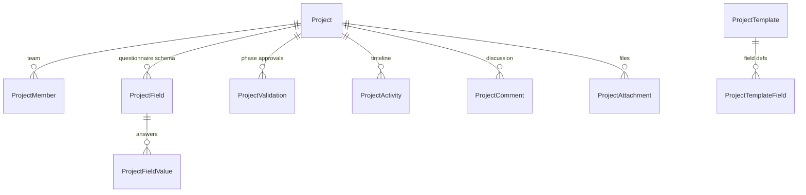

### Table: `Projects`

The root entity. Soft-deletable; carries the saved cahier as JSON.

| Column | Type | Null | Default | Notes |
|---|---|---|---|---|
| `id` | TEXT | no | uuid() | PK |
| `name`, `clientName` | VARCHAR(200) | no | — | |
| `startDate`, `endDate` | TIMESTAMPTZ | no | — | |
| `projectManagerId` | TEXT | no | — | FK → AppUsers — **NoAction** (PM can't be deleted while owning projects) |
| `status` | VARCHAR(50) | no | `Draft` | The 9-phase project status (see below) |
| `priority` | VARCHAR(50) | no | `Medium` | `Low` / `Medium` / `High` / `Critical` |
| `allowManagerCustomFields` | BOOLEAN | no | false | Gate for the PM adding their own questionnaire fields |
| `createdByAdminId` | TEXT | no | — | FK → AppUsers, NoAction |
| `createdAt`, `updatedAt` | TIMESTAMPTZ | no | now() | |
| **`aiOutput`** | TEXT | yes | — | **The saved cahier des charges as JSON.** See [Domain 3](#domain-3--cahier-des-charges-specification-document). |
| `isDeleted` | BOOLEAN | no | false | Soft-delete |
| `deletedAt` | TIMESTAMPTZ | yes | — | |
| `deletedByUserId` | TEXT | yes | — | FK → AppUsers, NoAction |
| `tags` | VARCHAR(500) | yes | — | Comma-separated |
| `budget` | DECIMAL | yes | — | Project budget (informational) |
| `currentPhaseEnteredAt` | TIMESTAMPTZ | yes | — | When the project entered its current `status` — drives "stuck in phase" alerts and analytics |

**Status values (`status`):**

| Value | Phase |
|---|---|
| `Draft` | Just created, not yet started |
| `Kickoff` | Project launched, in scoping |
| `CadrageTechnique` | Technical framing |
| `Environnement` | Environment provisioning |
| `Parametrage` | Configuration |
| `Integration` | Integration testing |
| `Recette` | UAT |
| `MEP` | Go-live ("Mise en production") |
| `Cloture` | Post-go-live closure |
| `Archived` | Closed projects |

**Indexes:** `(status)`, `(projectManagerId)`, `(isDeleted)`, `(priority)`, `(createdAt)`, composite `(isDeleted, status)`.

### Table: `ProjectMembers`

The per-project team. Drives access control and notifications.

| Column | Type | Null | Default | Notes |
|---|---|---|---|---|
| `id` | TEXT | no | uuid() | PK |
| `projectId` | VARCHAR(36) | no | — | FK → Projects, **CASCADE** |
| `userId` | VARCHAR(36) | no | — | FK → AppUsers, **CASCADE** |
| `label` | VARCHAR(150) | no | `''` | Free-text label — "Lead Frontend", "QA", "Spécialiste GED". Validated to 60 chars + regex `^[\p{L}\p{N}\s\-_]*$` at the DTO layer. |
| `createdAt` | TIMESTAMPTZ | no | now() | |
| `@@unique(projectId, userId)` | One row per (project, user) | `project_member_uq` |
| `@@index(projectId)`, `@@index(userId)` | Both lookup directions are common |

This is the **per-project access primitive**. The `ProjectAccessGuard`, the cahier review banner, and the assignment board all check membership here.

### Table: `ProjectFields`

Definition of a question on the project's questionnaire.

| Column | Type | Null | Default | Notes |
|---|---|---|---|---|
| `id` | uuid | no | — | PK |
| `projectId` | TEXT | no | — | FK → Projects, CASCADE |
| `label` | VARCHAR(200) | no | — | Question text |
| `fieldType` | VARCHAR(50) | no | `Text` | `Text`, `LongText`, `Number`, `Date`, `Select`, `Checkbox`, `MultiSelect` |
| `isRequired` | BOOLEAN | no | false | |
| `defaultValue` | VARCHAR(500) | yes | — | |
| `orderIndex` | INT | no | 0 | Display order |
| `fieldCategory` | VARCHAR(50) | no | `Dynamic` | `Static` (template), `Dynamic` (PM-added), `Custom` |
| `options` | TEXT | yes | — | For Select/MultiSelect — JSON array of options |
| `isBacklogDriver` | BOOLEAN | no | false | If true, the AI uses this answer when generating the backlog |
| `backlogHint` | VARCHAR(500) | yes | — | Hint passed to the LLM when generating |

Indexed by `projectId`.

### Table: `ProjectFieldValues`

The PM's answers.

| Column | Type | Notes |
|---|---|---|
| `id` | uuid | PK |
| `projectId`, `projectFieldId` | TEXT | FKs |
| `value` | TEXT? | |
| `updatedAt` | TIMESTAMPTZ? | |
| `updatedBy` | VARCHAR(36)? | who last edited (drives the live-collab field-focus indicator) |
| `@@unique(projectId, projectFieldId)` | One value per question per project |

### Table: `ProjectValidations`

Phase-level approvals. When the project advances from one phase to the next, designated users record an approval here.

| Column | Type | Notes |
|---|---|---|
| `id` | uuid | PK |
| `projectId` | TEXT | FK, CASCADE |
| `validatedByUserId` | TEXT | FK → AppUsers, NoAction |
| `validatedByRole` | VARCHAR(50) | Role at the time of validation (preserved for audit) |
| `phase` | VARCHAR(50) | Which phase was validated |
| `isApproved` | BOOLEAN | true = approved, false = rejected |
| `comment` | TEXT? | Required when rejected |
| `validatedAt` | TIMESTAMPTZ | |
| `@@unique(projectId, validatedByUserId, phase)` | One row per (project × user × phase) — re-submitting overwrites |
| `@@index(projectId, phase)` | For "who has validated phase X" queries |

> **Note:** This is **not** the cahier validation. The cahier has its own table — `CahierFeedback` — because cahier reviews can happen multiple times per project as it's regenerated.

### Table: `ProjectActivities`

Generic activity feed. Every state-change action creates a row here.

| Column | Type | Notes |
|---|---|---|
| `id`, `projectId`, `userId?` | | |
| `action` | VARCHAR(100) | Verb — `created`, `updated`, `cahier_generated`, `wp_assigned`, `validation_submitted` |
| `detail` | VARCHAR(500)? | Free-form description |
| `createdAt` | TIMESTAMPTZ | |
| `@@index(projectId)`, `@@index(createdAt)` | |

### Tables: `ProjectTemplates` + `ProjectTemplateFields`

Pre-defined sets of fields that are applied when creating a new project from a template (the "Modèles" feature in the PM nav).

`ProjectTemplate` has metadata (`name`, `description`, `createdByAdminId`); `ProjectTemplateField` has the same shape as `ProjectField` minus the project-specific values. When a template is applied, fields are copied into the new project's `ProjectField` rows.

### Table: `ProjectComments`

Project-level discussion thread (separate from work-package comments). Supports replies.

| Column | Notes |
|---|---|
| `id`, `projectId`, `userId`, `content`, `createdAt`, `updatedAt?`, `isDeleted` | |
| `parentCommentId?` | self-FK for threading |
| `mentions` | VARCHAR(500)? — comma-separated user IDs mentioned via `@user` |
| Indexed `(projectId)`, `(userId)`, `(createdAt)` | |

### Table: `ProjectAttachments`

Files uploaded to a project. Categorised: `Document`, `Specification`, `Contract`, `Screenshot`, `Image`, `Report`, `Other`.

| Column | Notes |
|---|---|
| `id`, `projectId`, `uploadedByUserId`, `fileName`, `fileExtension`, `contentType`, `fileSize` (BigInt), `storagePath`, `description?`, `category`, `uploadedAt`, `isDeleted` | |
| Indexed `(projectId)`, `(uploadedByUserId)`, `(uploadedAt)`, `(category)` | |

---

# Domain 3 — Cahier des charges (specification document)

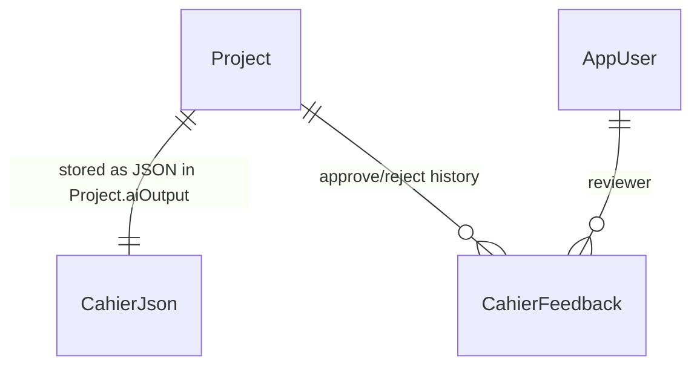

**The cahier itself is not a separate table.** It's stored as a JSON string in `Project.aiOutput`. Structure:

```json
{
  "aiContent": {
    "objectifDocument": "...",
    "contexte": "...",
    "objectifProjet": "...",
    "perimetreInclus": "...",
    "perimetreExclus": "...",
    "exigencesFonctionnelles": [{ "title": "...", "content": "..." }],
    "architectureTechnique":   [{ "title": "...", "content": "..." }],
    "livrables": "...",
    "conclusion": "..."
  },
  "savedAt": "2026-05-04T11:23:18.420Z"
}
```

This denormalisation is intentional: the cahier is consumed as a single payload, queried only by `projectId`, and replaced atomically when regenerated. Splitting it into 9 columns or sub-tables would add joins for zero benefit.

### Table: `CahierFeedback`

Each approve/reject action by a SpecificationTeam reviewer creates a row. The next time the AI regenerates the cahier, all rejection comments are injected into the prompt so the model corrects itself.

| Column | Type | Null | Default | Notes |
|---|---|---|---|---|
| `id` | uuid | no | — | PK |
| `projectId` | TEXT | no | — | FK → Projects, CASCADE |
| `userId` | TEXT | yes | — | FK → AppUsers, **SetNull** — feedback survives user deletion |
| `status` | VARCHAR(20) | no | `rejected` | `approved` / `rejected` |
| `comment` | TEXT | no | — | Required (≥10 chars on rejection) |
| `section` | VARCHAR(100) | yes | — | Which section was problematic — `contexte`, `objectifProjet`, etc. |
| `aiModel` | VARCHAR(50) | yes | — | Which model produced the version being reviewed |
| `createdAt` | TIMESTAMPTZ | no | now() | |
| `@@index(projectId, createdAt)` | Composite — drives the status-aggregation query in `getCahierStatus` |

**Status derivation logic:** the cahier's effective status is computed by joining `CahierFeedback` filtered by `createdAt >= savedAt` (the timestamp embedded in `Project.aiOutput`). Any feedback older than the latest save is ignored — regenerating resets the review queue.

```sql
-- Effective cahier status query (simplified)
SELECT
  CASE
    WHEN COUNT(*) FILTER (WHERE status = 'rejected') > 0 THEN 'rejected'
    WHEN COUNT(*) FILTER (WHERE status = 'approved') > 0 THEN 'approved'
    ELSE 'pending'
  END AS status
FROM "CahierFeedback"
WHERE projectId = $1
  AND createdAt >= $2;  -- $2 = Project.aiOutput.savedAt
```

---

# Domain 4 — Meetings

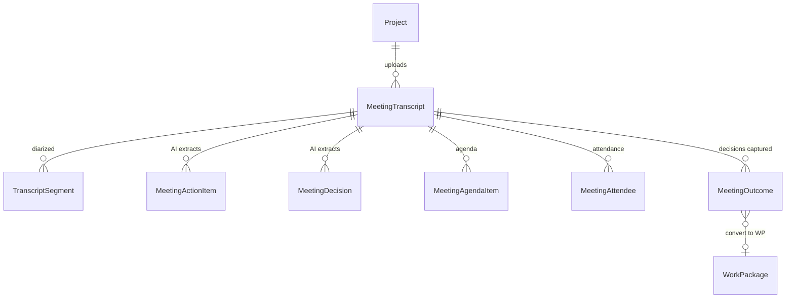

### Table: `MeetingTranscripts`

One row per uploaded meeting recording.

| Column | Type | Null | Default | Notes |
|---|---|---|---|---|
| `id` | uuid | no | — | PK |
| `projectId` | TEXT | no | — | FK, CASCADE |
| `title` | VARCHAR(200) | no | — | |
| `originalFileName` | VARCHAR(500) | yes | — | |
| `durationSeconds` | INT | no | 0 | |
| `detectedLanguages` | VARCHAR(50) | no | `''` | Comma-separated — `fr,en,ar` |
| `recordedAt` | TIMESTAMPTZ | no | now() | |
| `createdAt` | TIMESTAMPTZ | no | now() | |
| `aiSummary` | TEXT | yes | — | Markdown summary produced by the AI module |
| `aiStatus` | VARCHAR(20) | no | `none` | `none` / `pending` / `processing` / `completed` / `failed` |
| `aiStartedAt`, `aiProcessedAt` | TIMESTAMPTZ | yes | — | Observability |
| `aiModel` | VARCHAR(50) | yes | — | Which model produced the summary |
| `aiError` | VARCHAR(500) | yes | — | Last error message on failure |

Indexed `(projectId)`, `(createdAt)`, `(aiStatus)`.

### Table: `TranscriptSegments`

Speaker-diarized chunks. Each segment is one speaker's contiguous utterance.

| Column | Type | Notes |
|---|---|---|
| `id` | uuid | PK |
| `transcriptId` | TEXT | FK, CASCADE |
| `speaker` | VARCHAR(100) | "Speaker 1" by default; can be renamed via the rename-speaker endpoint |
| `text` | TEXT | |
| `startTime`, `endTime` | FLOAT | seconds from start of recording |
| `language` | VARCHAR(10) | Auto-detected per segment — `fr`, `en`, `ar` |
| `confidence` | FLOAT | Whisper confidence score 0–1 |

Indexed by `transcriptId`.

### Tables: `MeetingActionItems` + `MeetingDecisions`

After transcription completes, the AI parses the transcript and writes one row per action item or decision found. Both cascade on transcript deletion.

`MeetingActionItem` columns: `id`, `transcriptId`, `description` (TEXT), `assigneeName` (VARCHAR(200)?), `dueDate?`, `isCompleted`, `createdAt`.

`MeetingDecision` columns: `id`, `transcriptId`, `description`, `category` (`decision` / `risk`), `createdAt`.

### Tables: `MeetingAgendaItems`, `MeetingAttendees`, `MeetingOutcomes`

Pre/post-meeting structure.

- **`MeetingAgendaItems`** — pre-meeting agenda with `title`, `duration`, `responsibleId?`, `position`, `notes?`. Indexed `(meetingId, position)`.
- **`MeetingAttendees`** — attendance tracking: `userId?` (or `externalName/Email` for non-users), `isPresent`, `role?`. Indexed `(meetingId)`, `(userId)`.
- **`MeetingOutcomes`** — decisions captured during the meeting. Type: `Note` / `Decision` / `Action`. Has optional `ownerId`, `dueDate`, and **`workPackageId?`** for the "convert outcome to WP" feature. Indexed `(meetingId, type)`.

---

# Domain 5 — Work packages (tasks)

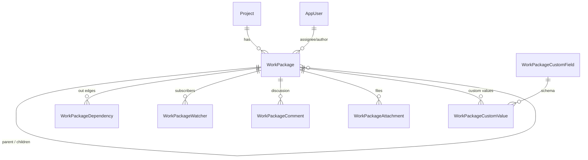

### Table: `WorkPackages`

The unit of work. Each task / feature / bug / epic is one row.

| Column | Type | Null | Default | Notes |
|---|---|---|---|---|
| `id` | uuid | no | — | PK |
| `projectId` | TEXT | no | — | FK, CASCADE |
| `title` | VARCHAR(255) | no | — | |
| `description` | TEXT | yes | — | |
| `type` | VARCHAR(20) | no | `Task` | `Task` / `Feature` / `Bug` / `Epic` / `Incident` |
| `status` | VARCHAR(20) | no | `New` | `New` / `InProgress` / `AwaitingReview` / `OnHold` / `Resolved` / `Closed` |
| `priority` | VARCHAR(20) | no | `Normal` | `Low` / `Normal` / `High` / `Critical` |
| `assigneeId` | TEXT | yes | — | FK → AppUsers, **SetNull** (so removing a user doesn't lose the WP) |
| `authorId` | TEXT | no | — | FK → AppUsers, NoAction |
| `parentId` | TEXT | yes | — | self-FK, SetNull — Epic → Task hierarchy |
| `sprintId` | TEXT | yes | — | FK → Sprints, SetNull |
| `versionId` | TEXT | yes | — | FK → Versions, SetNull |
| `boardColumnId` | TEXT | yes | — | FK → BoardColumns, SetNull |
| `startDate`, `dueDate` | DATE | yes | — | For Gantt rendering |
| `estimatedHours` | DECIMAL(8,2) | yes | — | |
| `spentHours` | DECIMAL(8,2) | no | 0 | Aggregated from time entries (denormalised) |
| `percentDone` | INT | no | 0 | 0–100 |
| `position` | INT | no | 0 | Order within board column / sprint |
| `isDeleted` | BOOLEAN | no | false | Soft-delete |
| `createdAt`, `updatedAt` | TIMESTAMPTZ | no | now() | |
| **SLA fields** | | | | Sprint 4 |
| `ackedAt` | TIMESTAMPTZ | yes | — | When acknowledged |
| `ackedByUserId` | TEXT | yes | — | |
| `escalatedAt` | TIMESTAMPTZ | yes | — | |
| `escalatedToUserId` | TEXT | yes | — | |
| `slaDeadline` | TIMESTAMPTZ | yes | — | |
| `slaKind` | VARCHAR(20) | yes | — | `ack` / `blocker` / `post_recette` / `post_prod` |
| `slaBreached` | BOOLEAN | no | false | |
| `aiGeneratedFrom` | VARCHAR(100) | yes | — | Tag like `questionnaire+cahier+meeting` |

**Indexes:**
- `(projectId, isDeleted, status)` — main list query
- `(projectId, status)` — secondary filter
- `(assigneeId, isDeleted)` — "my tasks" view
- `(assigneeId)` — fallback
- `(parentId)` — Epic expansion
- `(sprintId)`, `(versionId)`, `(boardColumnId)` — board / sprint / release filters
- `(slaDeadline, slaBreached)` — SLA breach query

### Table: `WorkPackageDependencies`

Directed graph between WPs.

| Column | Type | Notes |
|---|---|---|
| `id` | uuid | PK |
| `fromWpId`, `toWpId` | TEXT | FKs to WorkPackages, CASCADE |
| `type` | VARCHAR(32) | `blocks` / `follows` / `relates` |
| `createdAt` | TIMESTAMPTZ | |
| `@@unique(fromWpId, toWpId, type)` | Same edge can exist with different types |

### Table: `WorkPackageWatchers`

User subscriptions to WP changes.

| Column | Type | Notes |
|---|---|---|
| `id` | uuid | PK |
| `workPackageId`, `userId` | TEXT | FKs, CASCADE |
| `createdAt` | TIMESTAMPTZ | |
| `@@unique(workPackageId, userId)` | One subscription per user per WP |

### Tables: `WorkPackageCustomFields` + `WorkPackageCustomValues`

Per-project user-defined attributes on tasks.

`WorkPackageCustomField` defines the schema (name, type, options, position).
`WorkPackageCustomValue` holds values: `(workPackageId, customFieldId, value)`. UNIQUE on the pair, indexed on `customFieldId` for cascade deletes.

### Table: `WorkPackageComments`

Threaded discussion on a WP.

### Table: `WorkPackageAttachments`

Files uploaded to a specific WP.

---

# Domain 6 — Agile (boards / sprints / versions)

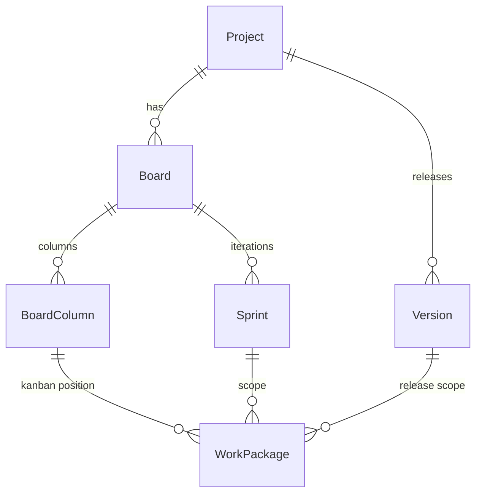

### Table: `Boards`

Kanban container.

| Column | Notes |
|---|---|
| `id`, `projectId`, `name` (VARCHAR(120)), `type` (default `Kanban`), `isDefault`, `createdAt`, `updatedAt` | |
| `@@unique(projectId, name)` | One board with each name per project |

The system auto-creates a "Default Kanban" with 4 columns on first GET.

### Table: `BoardColumns`

| Column | Notes |
|---|---|
| `id`, `boardId`, `name`, `position`, `wipLimit?`, `mapStatus?`, `createdAt` | |
| `@@index(boardId, position)` | For ordered render |

`mapStatus` lets a column "claim" a WP status — moving a card to that column auto-sets its status.

### Table: `Sprints`

Time-boxed iterations.

| Column | Notes |
|---|---|
| `id`, `boardId`, `name`, `goal?`, `startDate`, `endDate` (both DATE), `status` (`Planning` / `Active` / `Closed`), `capacity?` (DECIMAL(8,2)), `createdAt`, `updatedAt` | |
| `@@index(boardId, status)` | |

### Table: `Versions`

Release versions per project. WPs reference a version via `WorkPackage.versionId`.

| Column | Notes |
|---|---|
| `id`, `projectId`, `name`, `description?`, `startDate?`, `endDate?`, `status` (`Open` / `Locked` / `Closed`), `position`, `createdAt`, `updatedAt` | |
| `@@unique(projectId, name)` | |
| `@@index(projectId, status)` | |

---

# Domain 7 — Gantt (milestones / baselines)

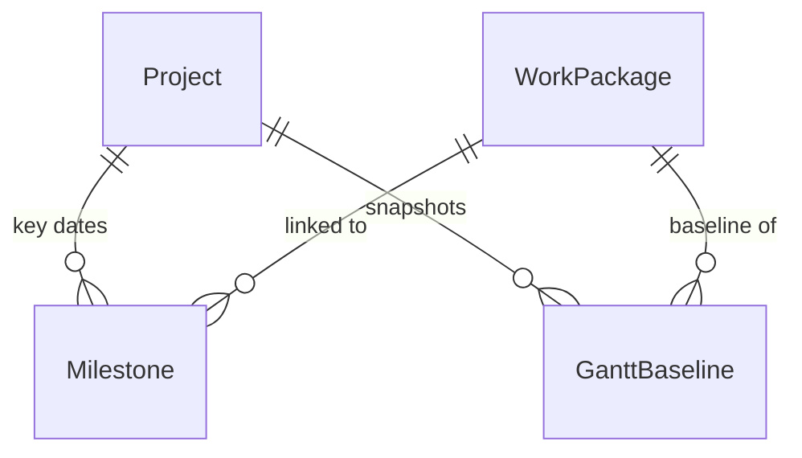

### Table: `Milestones`

Diamond-marker dates on the Gantt timeline. Optionally linked to a specific WP.

| Column | Notes |
|---|---|
| `id`, `projectId`, `workPackageId?` (NoAction on delete) | |
| `title`, `description?`, `date` (DATE) | |
| `isReached`, `color?`, `position`, `createdAt`, `updatedAt` | |
| `@@index(projectId, date)` | |

### Table: `GanttBaselines`

Dated snapshots of a WP's start/end/hours so drift can be visualised over time.

| Column | Notes |
|---|---|
| `id`, `projectId`, `workPackageId`, `snapshotDate`, `snapshotName` | |
| `startDate?`, `dueDate?`, `estimatedHours?`, `percentDone` | snapshot of WP at that date |
| `createdById` (FK → AppUsers, NoAction) | |
| `@@unique(projectId, snapshotName, workPackageId)` | One baseline of each WP per snapshot |
| `@@index(projectId, snapshotName)`, `@@index(workPackageId)` | |

---

# Domain 8 — Time tracking

### Table: `TimeEntries`

One row per logged hour-block.

| Column | Type | Null | Default | Notes |
|---|---|---|---|---|
| `id` | uuid | no | — | PK |
| `userId` | TEXT | no | — | FK → AppUsers, NoAction |
| `projectId` | TEXT | no | — | FK → Projects, CASCADE |
| `workPackageId` | TEXT | yes | — | FK → WorkPackages, NoAction |
| `hours` | DECIMAL(6,2) | no | — | |
| `spentOn` | DATE | no | — | Day the work was done |
| `activity` | VARCHAR(32) | no | `development` | Activity type |
| `comment` | TEXT | yes | — | |
| `isBillable` | BOOLEAN | no | true | |
| `lockedAt` | TIMESTAMPTZ | yes | — | Admin can lock periods to prevent retroactive edits |
| `createdAt`, `updatedAt` | | | | |

**Indexes:** `(userId, spentOn)`, `(projectId, spentOn)`, `(workPackageId)`.

> **Note:** `HourlyRates` was removed in May 2026 along with the budgeting module. Effective rate calculation is no longer part of the platform.

---

# Domain 9 — Notifications & automation

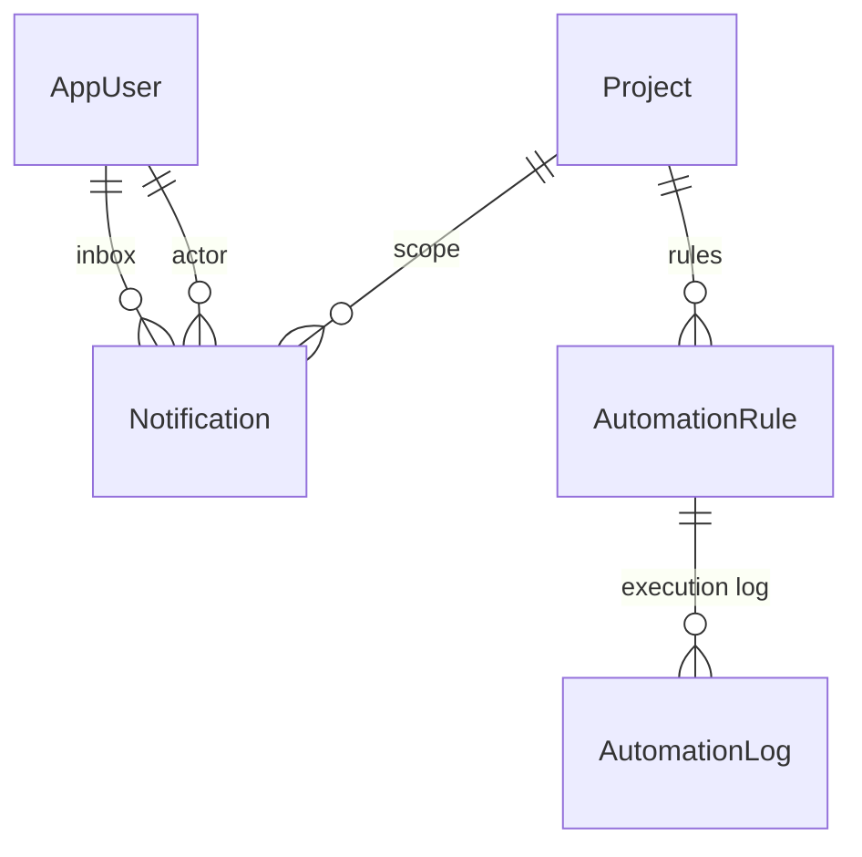

### Table: `Notifications`

Per-user inbox. Real-time push via Socket.IO + optional email.

| Column | Type | Null | Default | Notes |
|---|---|---|---|---|
| `id` | uuid | no | — | PK |
| `userId` | TEXT | no | — | FK → AppUsers, **CASCADE** — notifications are personal; deleted with the user |
| `type` | VARCHAR(50) | no | — | `wp_assigned`, `cahier_ready`, `cahier_approved`, `cahier_rejected`, `wp_bulk_assigned`, etc. |
| `title` | VARCHAR(200) | no | — | |
| `message` | VARCHAR(500) | no | — | |
| `projectId` | TEXT | yes | — | FK → Projects, **SetNull** — survives project deletion |
| `isRead` | BOOLEAN | no | false | |
| `createdAt` | TIMESTAMPTZ | no | now() | |
| `reason` | VARCHAR(40) | no | `system` | `Mention` / `Assignee` / `Watcher` / `Deadline` / `StatusChange` / `Comment` / `System` |
| `entityType` | VARCHAR(40) | yes | — | `work_package` / `project` / `meeting` / `comment` / `version` |
| `entityId` | TEXT | yes | — | What entity the notification is about |
| `actorId` | TEXT | yes | — | FK → AppUsers ("NotificationActor"), SetNull. Who triggered it; used to skip self-notifications. |
| `link` | VARCHAR(500) | yes | — | Front-end URL to navigate to |

**Indexes** (chosen carefully — this is a hot table):
- `(userId, isRead, createdAt DESC)` — main "unread inbox" query
- `(userId, isRead)` — count of unread
- `(userId, createdAt)` — read-all
- `(entityType, entityId)` — "all notifications about this WP"
- `(userId, reason)` — filter by reason

The membership check inside `notifyEnhanced` ensures notifications are only persisted when the target user is actually a member of the project (PM, project-scoped role assignment, or `ProjectMember` row).

### Table: `AutomationRules`

PM-defined "when X happens, do Y" rules per project.

| Column | Type | Notes |
|---|---|---|
| `id` | uuid | PK |
| `projectId` | TEXT | FK, CASCADE |
| `name` | VARCHAR(200) | |
| `triggerEvent` | VARCHAR(100) | `cahier_generated`, `status_changed`, `validation_submitted`, `wp_assigned`, etc. |
| `triggerCondition` | TEXT? | Optional JSON of conditions (`equals`, `not_equals`, `contains`) |
| `actionType` | VARCHAR(100) | `send_notification` / `update_field` |
| `actionConfig` | TEXT | **JSON blob** with action parameters |
| `isActive` | BOOLEAN | |
| `executionCount` | INT | Cumulative |
| `lastExecutedAt` | TIMESTAMPTZ? | |
| `createdAt` | TIMESTAMPTZ | |
| `@@index(projectId)`, `@@index(triggerEvent)` | |

### Table: `AutomationLog`

Execution history of every rule fire.

| Column | Notes |
|---|---|
| `id`, `ruleId` (CASCADE), `projectId`, `status`, `detail?`, `executedAt` | |
| `@@index(ruleId)`, `@@index(projectId)`, `@@index(executedAt)` | |

---

# Domain 10 — Cross-cutting (audit, cache, checklists)

### Table: `PhaseChecklists`

Per-phase tick-list items. Currently has no authoring UI but the backend service is wired.

| Column | Notes |
|---|---|
| `id`, `projectId`, `phase`, `label`, `isChecked`, `checkedBy?`, `checkedAt?`, `orderIndex`, `createdAt` | |
| `@@index(projectId, phase)` | |

### Table: `AuditLogs`

Sensitive-action audit trail.

| Column | Notes |
|---|---|
| `id`, `entityType` (50), `entityId` (36), `action` (50) | |
| `userId?` (NoAction — preserves history when user deleted) | |
| `changes?` (TEXT — JSON diff), `metadata?` (VARCHAR(1000)) | |
| `createdAt` | |
| `@@index(entityType, entityId)`, `@@index(userId)`, `@@index(createdAt)` | |

### Table: `AnalyticsCache`

Generic 15-minute TTL cache for the analytics dashboard's expensive aggregations.

| Column | Notes |
|---|---|
| `id`, `cacheKey` (UNIQUE VARCHAR(100)), `data` (TEXT — JSON), `computedAt` | |

---

## 16. Soft-delete and cascade strategy

The platform follows four different deletion strategies. Picking the right one for each FK is the single most important schema decision.

| Strategy | When | Examples |
|---|---|---|
| **Soft-delete** (`isDeleted = true`) | First-class entities that benefit from un-delete + audit | `Projects`, `WorkPackages`, `ProjectComments`, `WorkPackageComments`, `ProjectAttachments`, `WorkPackageAttachments` |
| **CASCADE** | Children that don't make sense without their parent | `ProjectMember.project`, `ProjectMember.user`, `TranscriptSegment.transcript`, `WorkPackageDependency.from/to`, `WorkPackageCustomValue.both`, `Notification.user`, `RolePermission.both`, `MeetingActionItem.transcript`, `MeetingDecision.transcript` |
| **SetNull** | History rows that should survive parent deletion | `CahierFeedback.user` (we keep the rejection comment even if the user is deleted), `Notification.actor`, `Notification.project`, `WorkPackage.assignee/parent/sprint/version/boardColumn`, `AppUser.team` |
| **NoAction** | Strict integrity — the parent must not be deletable while children exist | `Project.projectManager`, `Project.createdByAdmin`, `TimeEntry.user`, `WorkPackage.author`, `ProjectComment.user`, `MeetingOutcome.workPackage`, `Milestone.workPackage`, `ProjectActivity.user`, `AuditLog.user` |

**Why `Notification.user` is CASCADE but `AuditLog.user` is NoAction:** notifications are personal — when a user is removed, their inbox goes too (no one else can read it). Audit logs are for compliance and investigation — they must survive even if the actor is deleted (the user FK becomes nullable instead).

**Why `WorkPackage.assignee` is SetNull but `WorkPackage.author` is NoAction:** an assignee leaving the team is normal (the WP becomes unassigned). The author is the creator and is preserved for traceability — you must reassign or delete their WPs before deleting the user.

---

## 17. JSON columns

Three columns store JSON to avoid sub-tables for payloads that are read/written atomically:

### `Project.aiOutput` — the saved cahier des charges

```json
{
  "aiContent": { "objectifDocument": "...", "contexte": "...", ... },
  "savedAt": "ISO-8601 timestamp"
}
```

Read by `getPersistedCahier`, written by `savePersistedCahier`. Replaced atomically when regenerated. **Always** wrapped in try/catch when parsed (see [Migration history → 2026-05-03](#19-migration-history)).

### `AppUser.preferences`

```json
{
  "emailNotifications": true,
  "darkMode": false,
  "language": "fr",
  "savedFilters": [{ "name": "...", "filter": {...} }]
}
```

Defaults applied when null or unparseable. Stored as TEXT to avoid Postgres JSONB indexing overhead — these blobs are tiny and only read on profile-page mount.

### `AutomationRule.actionConfig`

```json
// For type = 'send_notification'
{ "recipientId": "uuid", "title": "...", "message": "..." }

// For type = 'update_field'
{ "fieldId": "uuid", "value": "..." }
```

Validated against the schema for the corresponding `actionType` at the service layer.

---

## 18. Indexing philosophy

The schema follows three rules:

1. **Index for real query shapes only.** No speculative indexes. Every `@@index` corresponds to an actual `WHERE`, `ORDER BY`, or join condition in a service file.

2. **Composite indexes lead with the most selective column.** E.g. `(projectId, isDeleted, status)` on WorkPackages: `projectId` narrows to ~100 rows, then `isDeleted` filters out trash, then `status` filters by phase. Each prefix is also useful — Postgres can use `(projectId)`, `(projectId, isDeleted)`, or all three.

3. **Foreign keys are not auto-indexed in Postgres.** We add `@@index([fkColumn])` explicitly when the FK is queried in the reverse direction. This is the difference from MySQL/MariaDB, which automatically index every FK.

**Hot indexes worth knowing about:**

| Table | Index | Used by |
|---|---|---|
| `Notifications` | `(userId, isRead, createdAt DESC)` | Inbox dropdown — every header render |
| `WorkPackages` | `(projectId, isDeleted, status)` | Main WP list — every project module render |
| `WorkPackages` | `(assigneeId, isDeleted)` | "My tasks" page |
| `CahierFeedback` | `(projectId, createdAt)` | `getCahierStatus` aggregation |
| `TimeEntries` | `(userId, spentOn)` | Weekly timesheet |
| `Projects` | `(isDeleted, status)` | Dashboard analytics |
| `ProjectValidations` | `(projectId, phase)` | Phase-validation queue |
| `MeetingTranscripts` | `(aiStatus)` | Background AI worker query |

---

## 19. Migration history

| # | Migration | Applied | Purpose |
|---|---|---|---|
| 1 | `20260427212925_init_postgres` | 2026-04-27 | Initial schema — bootstrap from MySQL → PostgreSQL |
| 2 | `20260502120000_add_project_members` | 2026-05-02 | Per-project team table with custom labels |
| 3 | `20260503010000_cahier_feedback_index` | 2026-05-03 | Composite `(projectId, createdAt)` for cahier-status aggregation |
| 4 | `20260503020000_wp_custom_value_index` | 2026-05-04 | Index `customFieldId` to speed cascading deletes |
| 5 | `20260504020000_drop_orphan_tables` | 2026-05-04 | Drop `ProjectBudgets`, `BudgetLineItems`, `Handovers`, `HandoverCriteria`, `ActivityRacis`, `HourlyRates` |
| 6 | `20260504030000_drop_wiki` | 2026-05-04 | Drop `WikiPages` + `WikiRevisions` — wiki feature retired |

All migrations are tracked in `web/back-nest/prisma/migrations/`. Apply with `npx prisma migrate deploy`.

**Notable evolution:**

- **2026-05-02** — `ProjectMember` introduced. Before this, project access was determined entirely by `projectManagerId` and `UserRoleAssignment`. After: a separate per-project team table that the `ProjectAccessGuard` checks first.
- **2026-05-03** — Cahier validation flow rebuilt. Old "approve in PMProjectDetail" inline form removed; new `CahierReviewActions.vue` component owns the flow exclusively. PM self-approval blocked at the service layer. SpecificationTeam scope tightened — only team members of *this specific project* receive `cahier_ready` notifications.
- **2026-05-03** — Multiple critical hardening pass: `ProjectAccessGuard` no longer accepts global `UserRoleAssignment` for non-Admin users (closes IDOR), JWT pinned to HS256 in both signing and verification, all bare `JSON.parse` calls wrapped in try/catch, double-toast eliminated.
- **2026-05-04** — Six orphan tables dropped after their owning modules were retired (budgeting, handovers, RACI, hourly rates).
- **2026-05-04** — Wiki module retired entirely (backend module, frontend view, store, schema models, search-service references all removed). Project documentation now lives in external tools (Confluence / SharePoint).

---

## 20. Glossary

| Term | Meaning |
|---|---|
| **Cahier des charges** | Specification document — French construction-industry term, here used for the AI-generated project specification |
| **PM** | Project Manager — owns one or more projects, drives the workflow |
| **Spec / SpecificationTeam** | Validation team — reviews and approves the cahier |
| **Realization team / Member** | Implementation team — executes the work packages |
| **Backlog IA** | The AI-generated list of Epics + Tasks proposed before the PM accepts them as `WorkPackage` rows |
| **Phase** | One of 9 canonical project states: Draft → Kickoff → CadrageTechnique → Environnement → Parametrage → Integration → Recette → MEP → Cloture |
| **Work Package (WP)** | The unit of work — task / feature / bug / epic / incident |
| **RBAC** | Role-Based Access Control — implemented as `Permission ←→ Role ←→ UserRoleAssignment` |
| **Soft-delete** | Marking a row as deleted (`isDeleted = true`) instead of removing it, so it can be restored |
| **CASCADE / SetNull / NoAction** | PostgreSQL FK behaviours: child deleted with parent / FK set to NULL / parent can't be deleted while child exists |

---

*Generated from `web/back-nest/prisma/schema.prisma` — keep this document in sync when adding/removing models or changing relations. The relational diagrams are Mermaid and render natively on GitHub / VS Code preview.*
